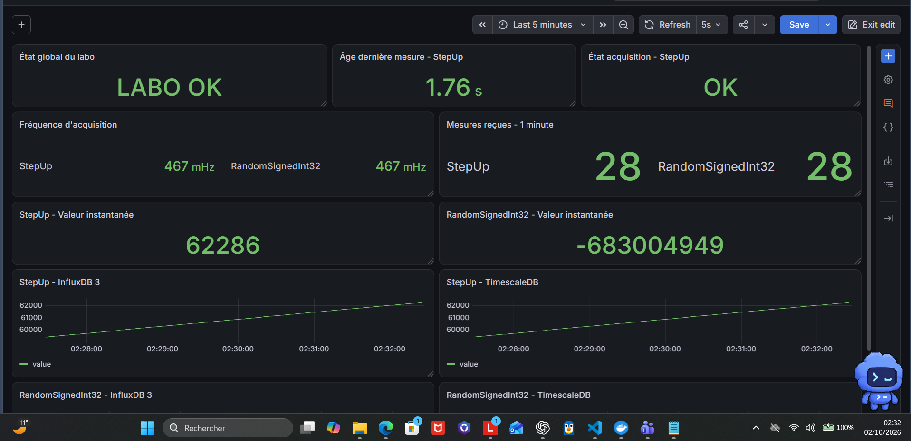
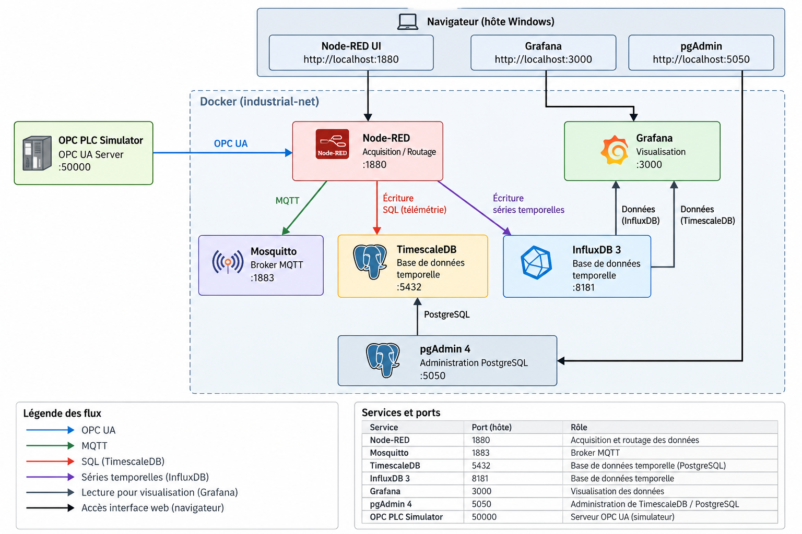
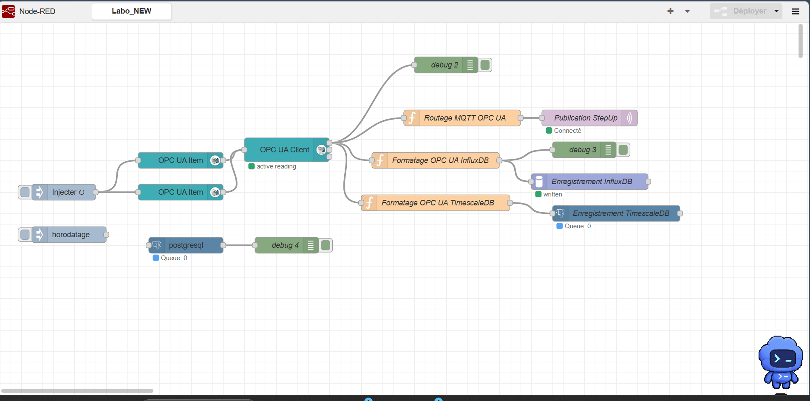
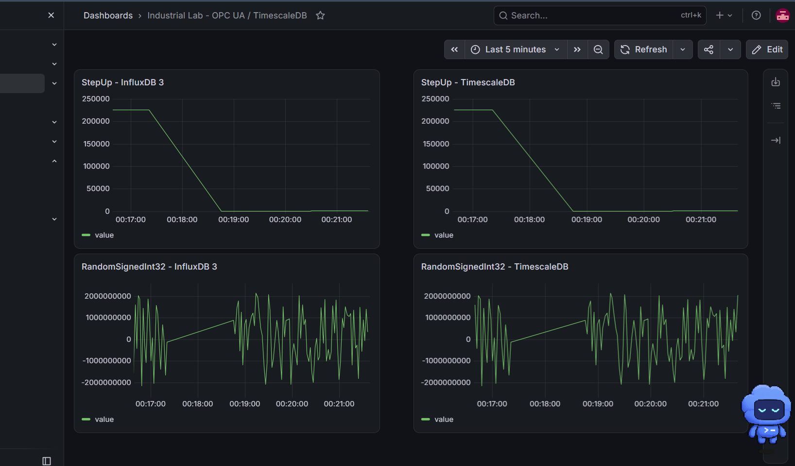
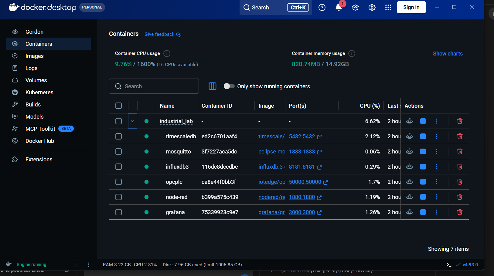
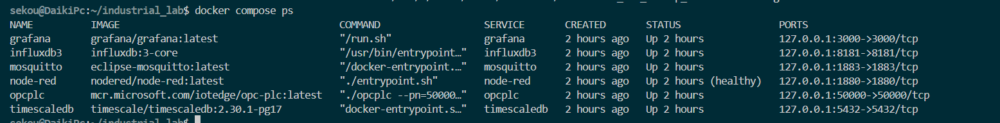

# Industrial IIoT Supervision Lab

> Laboratoire industriel local reproduisant une chaîne complète d'acquisition, de communication, d'historisation et de supervision de données avec **OPC UA, Node-RED, MQTT, InfluxDB 3, TimescaleDB, Grafana et Docker Compose**.


---

## Aperçu

Ce projet met en place un environnement **IIoT / informatique industrielle** entièrement local permettant de simuler une installation industrielle et de suivre les données depuis leur acquisition OPC UA jusqu'à leur visualisation dans Grafana.

Le laboratoire comprend **7 services Docker** :

- OPC PLC Simulator
- Node-RED
- Eclipse Mosquitto
- InfluxDB 3
- TimescaleDB / PostgreSQL
- Grafana
- pgAdmin 4

Deux variables OPC UA sont actuellement exploitées :

| Variable | NodeId | Type |
|---|---|---|
| `StepUp` | `ns=3;s=StepUp` | UInt32 |
| `RandomSignedInt32` | `ns=3;s=RandomSignedInt32` | Int32 |

L'acquisition est effectuée environ toutes les **2 secondes**, soit une fréquence proche de **0,5 Hz**.

---

 **[Consulter la documentation technique complète](docs/Industrial-IIoT-Supervision-Lab.pdf)**


## Dashboard de supervision

Le dashboard Grafana regroupe l'état du système, la fraîcheur des données, les valeurs instantanées et les historiques provenant des deux bases de données.



Il permet notamment de visualiser :

- l'état global du laboratoire ;
- l'état de l'acquisition ;
- l'âge de la dernière mesure ;
- la fréquence d'acquisition ;
- le nombre de mesures reçues sur une minute ;
- la valeur instantanée de `StepUp` ;
- la valeur instantanée de `RandomSignedInt32` ;
- les historiques InfluxDB 3 et TimescaleDB.

---

## Architecture

L'architecture repose sur un réseau Docker commun `industrial-net`, avec Node-RED comme couche d'intégration entre l'acquisition OPC UA, la messagerie MQTT, l'historisation et la supervision.



Node-RED joue le rôle de couche d'intégration entre le monde **OT** et les services de données.

---

## Flow Node-RED

Le même client OPC UA traite actuellement `StepUp` et `RandomSignedInt32`.

Les données sont ensuite dirigées vers trois branches :

1. publication MQTT ;
2. historisation InfluxDB 3 ;
3. historisation TimescaleDB.



Le flow exporté est disponible ici :

[`nodered/flows.json`](nodered/flows.json)

### Routage MQTT

Les topics sont générés dynamiquement :

```text
industrie/opcua/StepUp
industrie/opcua/RandomSignedInt32
```

Cela permet de conserver une séparation claire entre les différentes variables industrielles.

---

## Historisation des données

### InfluxDB 3

Les valeurs OPC UA sont enregistrées dans la base :

```text
industrial_lab
```

avec une measurement générique :

```text
opcua
```

Les variables sont différenciées grâce au tag `variable`.

### TimescaleDB

TimescaleDB repose sur PostgreSQL et utilise une hypertable :

```sql
mesures_opcua
```

Structure :

```sql
CREATE TABLE IF NOT EXISTS mesures_opcua (
    time TIMESTAMPTZ NOT NULL,
    machine TEXT NOT NULL,
    variable TEXT NOT NULL,
    value DOUBLE PRECISION NOT NULL
);
```

Le script complet est disponible dans :

[`timescaledb/schema.sql`](timescaledb/schema.sql)

---

## Comparaison InfluxDB 3 / TimescaleDB

Une partie du projet consiste également à comparer les deux solutions d'historisation sur les mêmes données OPC UA.



Les deux bases reçoivent les mêmes variables avec des timestamps issus de la source OPC UA.

Cela permet de comparer :

- une base dédiée aux séries temporelles : **InfluxDB 3** ;
- une extension temporelle de PostgreSQL : **TimescaleDB**.

---

## Docker Compose

L'ensemble du laboratoire est orchestré avec Docker Compose.



Les six services sont regroupés dans :

[`docker-compose.yml`](docker-compose.yml)

Vérification depuis le terminal :



---

## Ports

Tous les ports publiés sont limités à l'interface locale `127.0.0.1`.

| Service | Port | Fonction |
|---|---:|---|
| Grafana | `3000` | Supervision |
| TimescaleDB | `5432` | Historisation SQL temporelle |
| InfluxDB 3 | `8181` | Base de séries temporelles |
| Node-RED | `1880` | Acquisition et intégration |
| Mosquitto | `1883` | Broker MQTT |
| OPC PLC | `50000` | Serveur OPC UA simulé |
| pgAdmin 4 | `5050` | Administration PostgreSQL / TimescaleDB |

---

## Démarrage rapide

### 1. Cloner le dépôt

```bash
git clone https://github.com/daousekou/Industrial-IIoT-Supervision-Lab.git
cd Industrial-IIoT-Supervision-Lab
```

### 2. Créer le fichier d'environnement

```bash
cp .env.example .env
```

Puis définir son propre mot de passe TimescaleDB :

```env
TIMESCALE_PASSWORD=your_password_here
```

Le vrai fichier `.env` ne doit jamais être publié.

### 3. Démarrer les services

```bash
docker compose up -d
```

ou :

```bash
./scripts/start_lab.sh
```

### 4. Vérifier les conteneurs

```bash
docker compose ps
```

### 5. Initialiser TimescaleDB

```bash
docker compose exec -T timescaledb \
  psql -U postgres -d industrial_lab < timescaledb/schema.sql
```

### 6. Configurer Node-RED

Ouvrir :

```text
http://localhost:1880
```

Installer les modules nécessaires depuis **Manage palette** :

```text
node-red-contrib-opcua
node-red-contrib-influxdb3
node-red-contrib-postgresql
```

Puis importer :

```text
nodered/flows.json
```

### 7. Accéder à Grafana

```text
http://localhost:3000
```

L'export du dashboard utilisé dans le projet est disponible dans :

[`grafana/`](grafana/)

---

## Configuration OPC UA

Endpoint utilisé entre les conteneurs :

```text
opc.tcp://opcplc:50000
```

Configuration de sécurité utilisée dans Node-RED :

```text
Security Policy : Basic256Sha256
Security Mode   : SignAndEncrypt
```

Le simulateur utilise `--autoaccept` pour simplifier les essais dans cet environnement de laboratoire.

---

## MQTT

Mosquitto est utilisé comme broker local.

Configuration actuelle :

```text
listener 1883
allow_anonymous true
```

Cette configuration est volontairement simplifiée pour un laboratoire isolé.

En production, il faudrait notamment ajouter :

- authentification ;
- ACL ;
- TLS ;
- gestion des certificats.

---

## Validations réalisées

Les principaux tests réalisés sur l'architecture :

| Test | Résultat |
|---|:---:|
| Démarrage des 6 services Docker | ✅ |
| Connexion OPC UA | ✅ |
| Lecture `StepUp` | ✅ |
| Lecture `RandomSignedInt32` | ✅ |
| Acquisition cyclique ~0,5 Hz | ✅ |
| Publication MQTT | ✅ |
| Routage MQTT par variable | ✅ |
| Historisation InfluxDB 3 | ✅ |
| Historisation TimescaleDB | ✅ |
| Cohérence des timestamps | ✅ |
| Dashboard Grafana | ✅ |
| Indicateurs de fraîcheur des données | ✅ |
| Persistance des services | ✅ |
| Ports limités à localhost | ✅ |

---

## Structure du dépôt

```text
Industrial-IIoT-Supervision-Lab/
│
├── docker-compose.yml
├── .env.example
├── .gitignore
├── README.md
│
├── mosquitto/
│   └── config/
│       └── mosquitto.conf
│
├── nodered/
│   ├── README.md
│   └── flows.json
│
├── grafana/
│   └── Industrial Lab - OPC UA _ TimescaleDB-....json
│
├── timescaledb/
│   └── schema.sql
│
├── scripts/
│   ├── start_lab.sh
│   └── stop_lab.sh
│
└── docs/
    ├── commandes.md
    ├── securite.md
    ├── tests-realises.md
    │
    └── images/
        ├── grafana_supervision_v1.png
        ├── grafana_comparaison.png
        ├── nodered_flow_multivariable.png
        ├── docker_desktop_compose.png
        └── docker_compose_ps.png
```

---

## Sécurité

Ce dépôt représente un **laboratoire d'apprentissage**, pas une architecture de production.

Aucun secret réel ne doit être versionné.

Le fichier `.gitignore` exclut notamment :

```text
.env
*.env
*.pem
*.key
*.crt
```

Les ports sont publiés uniquement sur :

```text
127.0.0.1
```

Documentation complémentaire :

- [Sécurité](docs/securite.md)
- [Commandes utiles](docs/commandes.md)
- [Tests réalisés](docs/tests-realises.md)

---

## Perspectives

Les prochaines évolutions possibles du laboratoire incluent :

- alarmes et événements Grafana ;
- authentification MQTT ;
- gestion stricte des certificats OPC UA ;
- ajout de nouvelles variables industrielles ;
- KPI de production ;
- analyse Python des historiques ;
- détection d'anomalies ;
- maintenance prédictive ;
- intégration future avec ROS 2.

---

## Objectif du projet

Ce laboratoire a été développé afin d'approfondir concrètement plusieurs compétences utilisées en **automatisme et informatique industrielle** :

**OPC UA • MQTT • Node-RED • Docker • IIoT • PostgreSQL • TimescaleDB • InfluxDB • Grafana • supervision industrielle**
